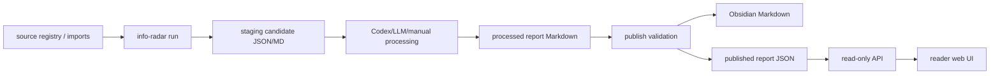

# Reader Web Service Design

## Goal

Build an internal reader-facing web surface for Info Radar. The page opens directly into the latest daily brief and serves decision makers who want to read, drill into deep source cards, and verify evidence. It is not a maintenance console.

## Boundary Conditions

- Reader UI only: no source registry editing, no run buttons, no publish buttons, no pipeline dashboard, no admin queue.
- The existing CLI remains the maintenance surface for fetching, importing, scoring, LLM/Codex processing, and publishing.
- The web service consumes already-published daily reports. It does not re-run LLM extraction or change report content.
- The report contract remains the three-layer structure: `核心阅读区 -> 深度阅读区 -> 证据区 -> 原文 URL`.
- The first implementation can run on an internal host with a local filesystem-backed reports directory.

## Product Shape

The reader opens `/` and sees the latest daily report.

The top bar contains only:

- `信息雷达`
- current report date
- date selector
- search
- compact topic/source chips

The main page contains:

- `今日概览`: counts and source/date metadata.
- `核心阅读区`: default expanded, optimized for a 3-5 minute morning read.
- `深度阅读区`: source-level cards reachable from each core item.
- `证据区`: trace cards reachable from deep cards and source links.

The UI should be quiet, editorial, and information dense without becoming a dashboard.

## Architecture



The new web layer has three components:

1. Published report exporter: parse final Markdown into structured JSON.
2. Read-only API: serve report list, latest report, report detail, and search.
3. Static reader UI: fetch JSON and render the daily brief.

## Data Contract

Published report JSON:

```json
{
  "date": "2026-07-01",
  "title": "2026-07-01 信息雷达晨报",
  "source_markdown_path": "/path/to/processed.md",
  "core_items": [
    {
      "id": "C1",
      "number": 1,
      "title": "LLM 风险正在从模型缺陷转移到应用栈失控",
      "abstract": "中文核心判断正文",
      "recommendation_reason": "具体推荐理由",
      "deep_ids": ["D1"]
    }
  ],
  "deep_items": [
    {
      "id": "D1",
      "title": "LLM 应用栈漏洞生命周期综述",
      "body": "单源深度提炼",
      "recommendation_reason": "具体推荐理由",
      "evidence_strength": "high",
      "risk": "未见明显推广",
      "evidence_id": "E1"
    }
  ],
  "evidence_items": [
    {
      "id": "E1",
      "title": "LLM 应用栈漏洞生命周期综述",
      "url": "http://arxiv.org/abs/2606.31639v1",
      "source_type": "arXiv 论文",
      "published_at": "2026-06-30T13:21:43Z",
      "ad_risk": "未见明显推广",
      "usage": "支持风险从模型本体转向应用栈和权限链路的判断"
    }
  ]
}
```

## API Contract

- `GET /healthz`: returns `{"status": "ok"}`.
- `GET /api/reports`: returns available reports sorted by date descending.
- `GET /api/reports/latest`: returns the latest report JSON.
- `GET /api/reports/{date}`: returns a specific report JSON or `404`.
- `GET /api/search?q=...`: searches report titles and body text across core, deep, and evidence items.

## Service Model

The service should run as:

```bash
uv run info-radar web --host 0.0.0.0 --port 8787 --reports-dir .info_radar/published
```

The web app serves static assets and API from the same process. A company gateway or Nginx can reverse proxy to this process on the internal network.

## Testing

- Parser tests prove final Markdown becomes structured JSON with core/deep/evidence links preserved.
- CLI tests prove `publish` writes both Obsidian Markdown and web JSON.
- API tests prove latest report, date report, list, search, and health endpoints.
- Frontend smoke test proves static assets are present and use the API endpoints.

## Non-Goals

- No login or SSO in the first implementation.
- No admin console.
- No source editing in the browser.
- No LLM execution from the web server.
- No database migration beyond reading JSON report files.
